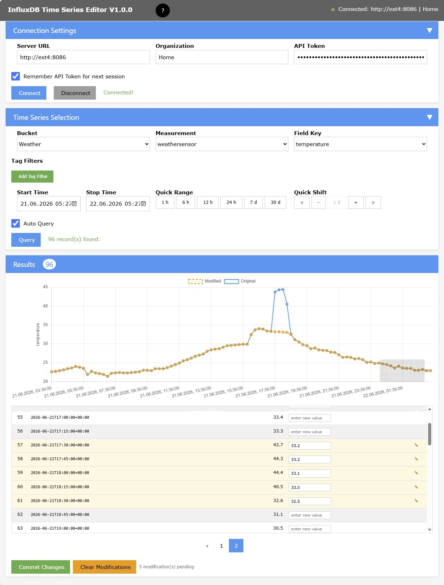

# InfluxDB Time Series Editor V1.1.0

A browser-based editor for time series data stored in an **[InfluxDB V2](https://docs.influxdata.com/influxdb/v2/)** database.  
The application is a Flask backend + W3.css/Chart.js frontend, packaged as a Docker container.

For details, see [InfluxDB TS Editor Documentation](https://signag.github.io/influx_ts_editor/latest/) with
- [Getting Started](https://signag.github.io/influx_ts_editor/latest/getting_started/)
- [Features](https://signag.github.io/influx_ts_editor/latest/features/)
- [Release Notes](https://signag.github.io/influx_ts_editor/latest/release_notes/)
- [Usage](https://signag.github.io/influx_ts_editor/latest/usage/)

