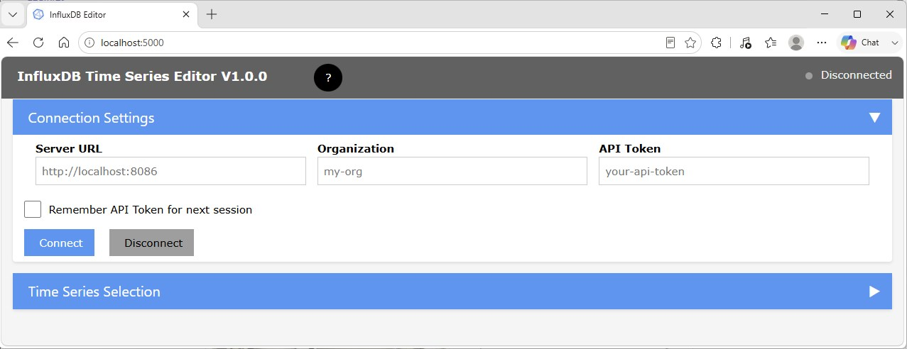
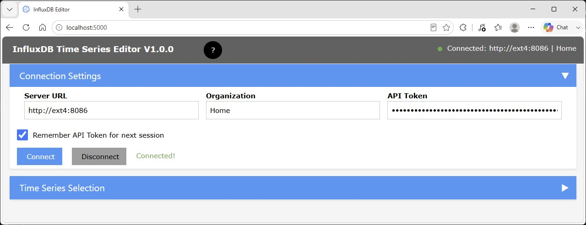
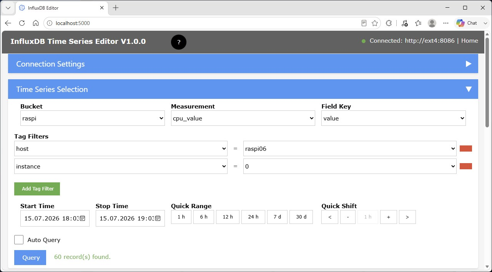
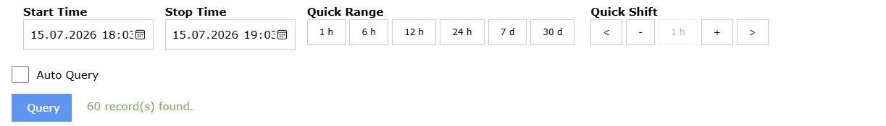
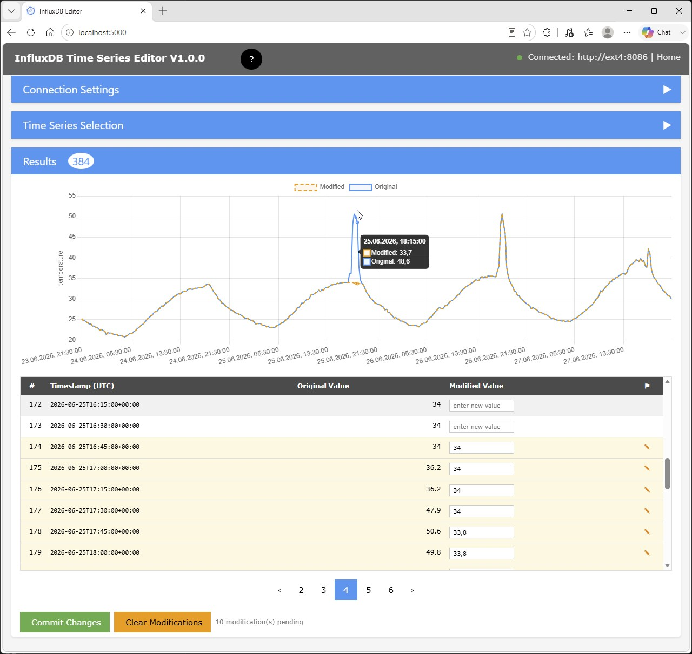

# Influx Time Series Editor Usage

[](./index.md)

## Starting *Influx TS Editor*

In a browser, enter URL and port specified during [installation](./getting_started.md#installation), e.g.   
http://localhost:8087

## Connecting to an InfluxDB Instance

When initially started, the section for *Connection Settings* is shown with empty credential fields:



- Enter server and port of your InfluxDB instance
- Enter the [Influx Organization](https://docs.influxdata.com/influxdb/v2/admin/organizations/view-orgs/) under which the data of interest are located.
- For authorization, you need an [Influx API Token](https://docs.influxdata.com/influxdb/v2/admin/tokens/#api-token-types) which allows access to the data of interest. If an [All Access API Token](https://docs.influxdata.com/influxdb/v2/admin/tokens/#all-access-token) has been generated, it is recommended to use this.

If you want to reuse these settings for future database access, check the *Remember API Token for next session* checkbox.

After pressing the **Connect** button, the connection to the specified instance will be established and the connection status is shown in the top application bar:



Now you can close the *Connection Settings* group using the arrow button.

## Selecting a Time Series

With connection to the InfluxDB, the list of available buckets will be populated for selection:

 

Successively, you select a *Bucket*, a *Measurement* and a *Field Key*.

For filtering a specific Time Sequence, you may need to add *Tag Filters* using the **Add Tag Filter** button.    
Each *Tag Filter* requires a [Tag Key](https://docs.influxdata.com/influxdb/v2/reference/key-concepts/data-elements/#tag-key) and a [Tag Value](https://docs.influxdata.com/influxdb/v2/reference/key-concepts/data-elements/#tag-value).

Tag Filters will only be available for selection after at least a *Bucket* and a *Measurement* have been specified.

Tag filters can be removed by clicking on the red rectange on the right side of a filter entry.

## Selecting a Time Range

To locate the Time Series data to be modified, you need to select the relevant time range:



**NOTE**: Time range specification use the local date/time.

Initially, the time range is set to one hour before the current time.

You can now either choose a different time range using the calendar controls for *Start Time* and *Stop Time*.

### Quick Range

To change the size of time window, you can use one of the *Quick Range* buttons.     
This will update the time range, **keeping the center** of the previously set range.

**NOTE**: If the stop time would be later than the current time, it is set to the current time.

### Quick Shift

The center field of *Qick Shift* displays the active size of the time range. It is updated after pressing one of the *Quick Range* buttons.

Using the **+** and **-** buttons, you can increse or decrease the window size.

Using the **```<```** or **```>```** buttons, you can shift the time range backward or foreward in time.     
The shift will be by **half the window size**.

**NOTE**: If the stop time would be later than the current time, it is set to the current time.

### Query

The **Query** button will execute a query with the current settings.

To immediately see the effect of changing *Quick Range* or *Quick Shift*, you can activate the **Auto Query** checkbox.

*Auto Query* is not executed when the time range is changed by use of the calendar controls.

## Data

The query will retrieve the Time Series data from the InfluxDB and present them as chart and as table:



The example above is a Time Series for the temperature measured by a sensor which, in certain time periods, was exposed to direct sun radiation, producing the exceptional peaks of unrelistic air temperatures.

**NOTE**: The chart x-axis uses the actual UTC timestamps from InfluxDB, so gaps between points reflect the real elapsed time.

Blue lines and data points represent the original data.     
Orange lines and data points represent the modified data.

You can hover with the mouse over the data points to visualize timestamp and Field Values.

### Editing Field Values

In the column *Modified Value* you can enter modified values.     
Modified rows are highlighted and carry a special marker.
Modified values are committed using the original field value type retrieved during the query.

### Committing changes

After review of modifications, use button **Commit Changes** to commit the modified Field Values to the database

To reverse all modifications, use the **Clear Modifications** button.
